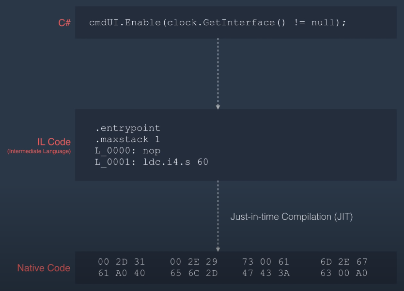
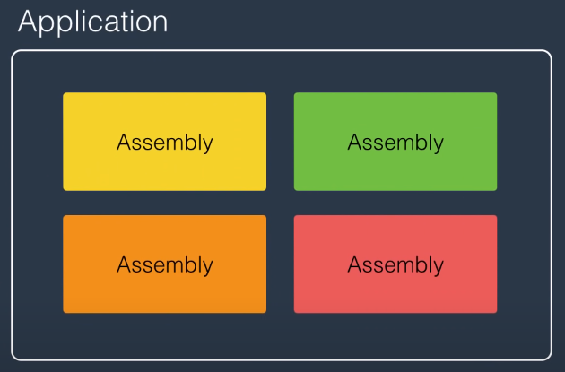
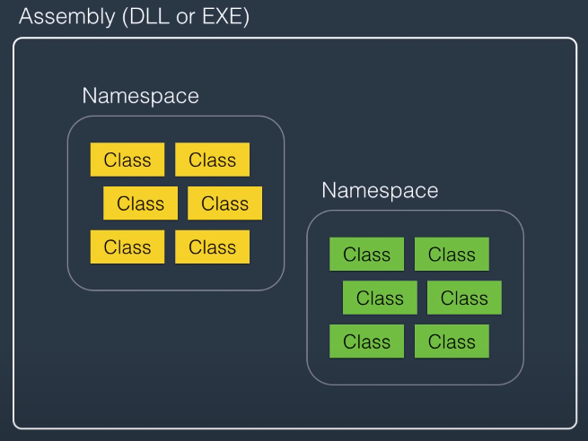
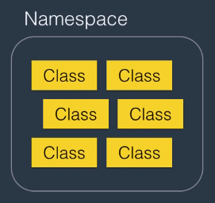
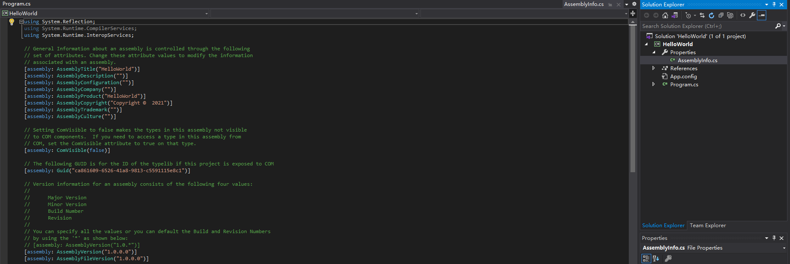
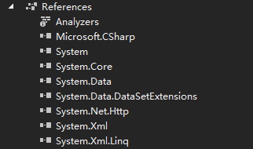
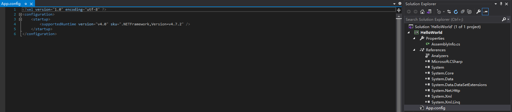
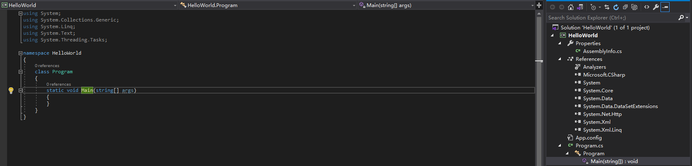

[TOC]

### .NET
#### A Framwork for building applications on windows not limited on C#
1. CLR(Common Language Runtime)
1.1 Just In Time Compilation(JIT)
C# Code compiled to IL Code(intermediate luanguage code) which is independent of the computer,CLR translate the IL Code into the Native Code(Machine Code)


2. FCL(Framework Class Library) 

### C# A Programming Language
#### Architecture of .NET Application

1. Application


2. Assembly（程序集）
a container for related namespaces,a file can either be an executable or a DLL for dynamically linked library


3. Namespace
a container for related classes


#### C# FUNDAMENTALS
1. Variables and Constants
1.1 Variable:a name given to a storage location in memory
1.2 Constant:an immutable value

2. Declaring Variables/Constants
```csharp
int number;
int Number=1;
const float Pi=3.14f;
```


### Visual Studio
#### EX:Console Application
1. Properties
1.1 AssemblyInfo.cs
Assembly's Title,Description,Copyright,Guid,Version...

2. References
2.1 a bunch of assemblies referenced by your project

2.2 App.config
store the configuration for your application
ex: connection strings to the database or some settings about your application

3. Program.cs
3.1 using System;
if you want to use a class that is defined in a different namespace,we need to import it in our code with using statement
3.2 namespace HelloWorld
VS creates a namespace called HelloWorld(project name) by default 
3.3 class Program
default class
3.4 Main()
A method which is the entry point to the application
When you run your application CLR execute the code inside main method 


#### Shortcut
Ctrl + X :remove the unnecessary usings which are grayed out by row
Alt + Enter : remove all the unnecessary usings
Ctrl + F5 : start without debugging
F5 : start debugging
F10 : step over
F11 : step into

fuck
shit
